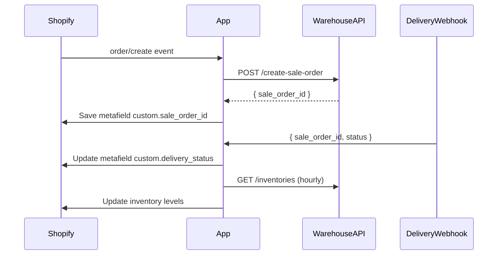

# 🧩 Shopify Admin App — Technical Specification

## 🏗️ Mục tiêu tổng quan

Ứng dụng **Shopify Admin App** được xây dựng nhằm:
- Tự động **đồng bộ dữ liệu tồn kho** giữa Shopify và hệ thống kho vận.
- Tự động **tạo đơn vận chuyển (xuất kho)** khi có đơn hàng mới trên Shopify.
- Theo dõi và **cập nhật trạng thái giao hàng realtime** thông qua webhook từ bên vận chuyển.
- Cung cấp **giao diện quản lý đơn hàng** (danh sách & chi tiết) trong Shopify Admin.

---

## ⚙️ 1. Quy trình tổng thể

### 1.1. Khi đơn hàng mới được tạo trên Shopify
1. Ứng dụng nhận sự kiện `order/create` (qua Shopify webhook hoặc API polling).
2. Gọi **API POST của bên vận chuyển** để tạo **mã xuất kho** tương ứng.
3. Nhận về `sale_order_id` (mã xuất kho từ hệ thống vận chuyển).
4. Lưu `sale_order_id` vào **Shopify Order Metafield**:
   - Namespace: `custom`
   - Key: `sale_order_id`
   - Value: `<mã xuất kho từ API>`

📦 **Kết quả:**  
Đơn hàng Shopify được liên kết 1-1 với đơn hàng xuất kho bên vận chuyển.

---

### 1.2. Cập nhật trạng thái vận chuyển (Delivery Status)

1. Bên vận chuyển sẽ gọi tới **webhook** của ứng dụng mỗi khi trạng thái vận chuyển thay đổi.
2. Webhook này sẽ:
   - Nhận payload chứa `sale_order_id` và `status`.
   - Tra cứu đơn hàng tương ứng trên Shopify dựa theo metafield `custom.sale_order_id`.
   - Cập nhật metafield:
     - Namespace: `custom`
     - Key: `delivery_status`
     - Value: `<trạng thái mới>` (VD: `pending`, `shipping`, `delivered`, `cancelled`)

📬 **Ví dụ luồng dữ liệu webhook:**
```json
{
  "sale_order_id": "VNC123456",
  "status": "delivered",
  "updated_at": "2025-10-30T15:30:00Z"
}
```

🧠 **Kết quả:**  
Shopify order luôn hiển thị trạng thái giao hàng mới nhất (qua metafield `delivery_status`).

---

## ⏱️ 2. Đồng bộ tồn kho (Inventory Sync)

Ứng dụng có tiến trình định kỳ **chạy mỗi 1 giờ/lần** (cron job hoặc background worker).

### Quy trình

1. Gọi API kho vận:  
   `GET /inventories?warehouse_id=<id>&page=1&limit=...`

2. Lấy dữ liệu tồn kho từng sản phẩm (trường `inventory_quantity` hoặc `sale_inventory_quantity`).

3. Đồng bộ tồn kho này với Shopify qua:
   - Shopify REST API: `/admin/api/2024-10/inventory_levels/set.json`
   - Hoặc GraphQL `inventoryAdjustQuantity`

### Danh sách kho cần đồng bộ

| warehouse_id | Tên kho | Vai trò |
|---------------|----------|----------|
| 7 | Narita - JP | Kho đóng gói (Pack warehouse) |
| 9 | Ba Đình - HN | Kho phát hàng (Dispatch warehouse) |

> Gợi ý triển khai:  
> Có thể chạy đồng bộ song song 2 kho hoặc gộp dữ liệu trước khi update Shopify.

📦 **Mục tiêu:**  
Đảm bảo số lượng tồn kho trên Shopify luôn khớp với hệ thống kho vận.

---

## 🧭 3. Cấu trúc giao diện trong Shopify Admin

Ứng dụng có 2 trang chính hiển thị trong Admin App:

### 3.1. Trang danh sách đơn hàng (Order List)
Hiển thị các đơn hàng Shopify kèm thông tin từ metafields.

**Thông tin hiển thị:**
| Cột | Dữ liệu | Nguồn |
|-----|----------|--------|
| Order ID | Mã đơn hàng Shopify | Shopify API |
| Ngày tạo | `created_at` | Shopify |
| Sale Order ID | `custom.sale_order_id` | Metafield |
| Delivery Status | `custom.delivery_status` | Metafield |
| Tổng giá trị | `total_price` | Shopify |
| Số lượng sản phẩm | `line_items_count` | Shopify |
| Warehouse | Cấu hình (7 hoặc 9) | App settings |

💡 **Chức năng bổ sung:**
- Nút “Xem chi tiết”
- Bộ lọc theo `delivery_status` (`pending`, `shipping`, `delivered`)
- Tìm kiếm theo `order_id` hoặc `sale_order_id`

---

### 3.2. Trang chi tiết đơn hàng (Order Detail)

Hiển thị đầy đủ thông tin:
- **Thông tin khách hàng**: tên, email, địa chỉ.
- **Danh sách sản phẩm**: tên, SKU, số lượng, giá.
- **Thông tin giao hàng**:  
  - `sale_order_id`
  - `delivery_status`
  - Ngày giao hàng, mã vận đơn (nếu có)
- **Hành động thủ công**:
  - Gửi lại yêu cầu tạo đơn vận chuyển.
  - Cập nhật trạng thái thủ công (nếu webhook bị lỗi).
  - Đồng bộ lại tồn kho cho sản phẩm trong đơn.

---

## 🧱 4. Cấu trúc kỹ thuật & lưu trữ

### 4.1. Hosting & Database

- App backend chạy trên **AWS EC2** (Node.js hoặc Laravel tùy chọn).
- Dùng **SQLite local** trong EC2 (không cần RDS riêng), vì ứng dụng chỉ lưu:
  - Phiên Shopify (`session`)
  - Log sự kiện webhook
  - Cấu hình kho (warehouse_id, API keys, etc.)

### 4.2. Không lưu dữ liệu khách hàng hay đơn hàng dài hạn.  
Toàn bộ thông tin đọc realtime từ Shopify API.

---

## 🔐 5. Xác thực & bảo mật

| Thành phần | Cách xác thực |
|-------------|----------------|
| Shopify → App | OAuth App Token |
| App → Kho vận | Bearer Token hoặc IP whitelist |
| Webhook (Từ kho vận) | Secret header `X-Warehouse-Signature` để xác minh |
| Cron Job | Chạy nội bộ trong EC2, không public endpoint |

---

## 🔁 6. Luồng dữ liệu tổng quan



---

## 📅 7. Lịch trình thực thi

| Tác vụ | Tần suất | Phương thức |
|--------|-----------|-------------|
| Tạo đơn vận chuyển | Realtime (khi có order mới) | Webhook `order/create` |
| Cập nhật trạng thái giao hàng | Realtime | Webhook từ kho |
| Đồng bộ tồn kho | 1 giờ/lần | Cron job |
| Kiểm tra lỗi API | 1 lần/ngày | Background report |

---

## 🧩 8. Shopify Metafields cấu hình

| Namespace | Key | Type | Description |
|------------|-----|------|-------------|
| `custom` | `sale_order_id` | string | Mã xuất kho từ hệ thống vận chuyển |
| `custom` | `delivery_status` | string | Trạng thái giao hàng hiện tại (`pending`, `shipping`, `delivered`, `cancelled`) |

---

## 📘 9. Tài liệu API liên quan

- [Inventories API (Warehouse)](./inventories_api.md)
- [Shopify Order API](https://shopify.dev/docs/api/admin-rest/2024-10/resources/order)
- [Shopify Metafield API](https://shopify.dev/docs/api/admin-rest/2024-10/resources/metafield)
- [Shopify Inventory API](https://shopify.dev/docs/api/admin-rest/2024-10/resources/inventorylevel)

---

_Last updated: 2025-10-30_
